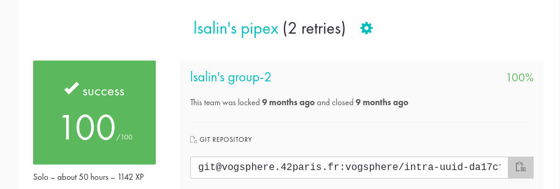

# Pipex

🇫🇷

Le but du projet "Pipex" est d'implémenter un programme en C qui simule le fonctionnement des pipes dans un shell UNIX.  
Ce programme prend quatre arguments : deux noms de fichiers et deux commandes shell avec leurs paramètres.  
Le programme doit fonctionner exactement comme la commande `shell < file1 cmd1 | cmd2 > file2`.

Le code doit respecter la Norme imposée par 42 (voir pdf).

__Comment tester le programme__ ?

* Exécutez la commande `make` à la racine du répertoire.
* Créez un fichier (par exemple "infile") et remplissez le de caractères.
* Exécutez la commande `./pipex infile "cat" "wc -l" outfile` qui compte le nombre de lignes dans un fichier. Cette commande doit être identique à `< infile cat | wc -l > outfile`.
* Vous pouvez maintenant `cat outfile` et remarquer que le programme marche comme attendu.
  
__D'autres exemples__ :

* `./pipex infile "grep 'string'" "wc -l" outfile` doit être identique à `< infile grep 'string' | wc -l > outfile`. Compte combien de fois 'string' apparaît dans le fichier infile puis affiche ce nombre dans outfile.
* `./pipex infile "ls -l" "grep '.txt'" outfile` doit être identique à `< infile ls -l | grep '.txt' > outfile`. Filtre et affiche dans outfile les fichiers '.txt' listés dans infile.

🇬🇧

The goal of the "Pipex" project is to implement a C program that simulates the operation of pipes in a UNIX shell.
This program takes four arguments: two filenames and two shell commands with their parameters.
The program should work exactly like the command `shell < file1 cmd1 | cmd2 > file2`.

The code must respect the Norm imposed by 42 (see pdf).

__How to test the program?__

* Run the `make` command at the root of the directory.
* Create a file (for example "infile") and fill it with characters.
* Run the command `./pipex infile "cat" "wc -l" outfile` which counts the number of lines in a file. This command should be the same as `< infile cat | wc -l > outfile`.
* You can now `cat outfile` and notice that the program works as expected.

__Other examples:__

* `./pipex infile "grep 'string'" "wc -l" outfile` must be the same as `< infile grep 'string' | wc -l > outfile`. Count how many times 'string' appears in infile and then print that number in outfile.
* `./pipex infile "ls -l" "grep '.txt'" outfile` should be the same as `< infile ls -l | grep '.txt' > outfile`. Filters and displays in outfile the '.txt' files listed in infile.

